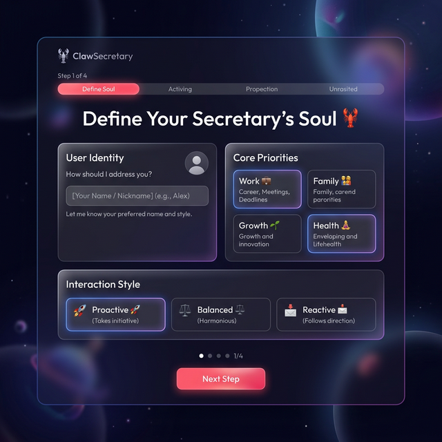
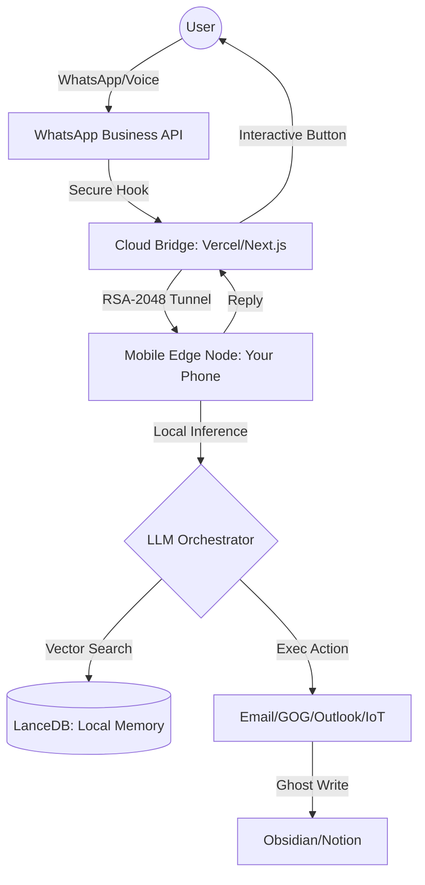

# ClawSecretary: The Autonomous Mobile-Edge SaaS 🦞🚀

# 🦞 ClawSecretary: The Premium Mobile-Edge Assistant

**Autonomía total. Privacidad absoluta. Magia pura.**


ClawSecretary es un asistente inteligente de nivel ejecutivo que vive en tu bolsillo pero piensa en el borde. Utiliza la arquitectura **"Cloud as a Bridge, Edge as the Brain"** para ofrecerte una suite de productividad sin precedentes sin que tus datos toquen nunca la nube.

---

## 🏁 The Magic Onboarding Journey 🦞✨

Hemos diseñado el flujo de configuración más sencillo del mercado. **Cero fricción.**

### 1. El Portal (Activación Web)
Entra en [clawsecretary.io](https://clawsecretary.io) y crea tu cuenta. Un asistente visual te guiará para definir la personalidad de tu Secretario (SOUL.md) sin que veas una sola línea de código.



### 2. El Enlace Mágico (Emparejamiento QR)
Escanea el código QR que aparecerá en tu Dashboard Web. Tu móvil abrirá instantáneamente el **Dashboard PWA** configurado y listo para funcionar.

### 3. Social Sync (OAuth 2.0)
Conecta Google, Notion o WhatsApp con un click desde tu móvil. Los tokens se inyectan directamente en tu dispositivo local mediante nuestro puente seguro y efímero.

### 4. Gestión de Cuenta (SaaS Portal)
Accede a tu panel para renovar, cancelar o cambiar de plan (Lanzamiento, Pro, Business) de forma 100% visual.


---

## 🛠️ Advanced: Self-Hosted Node (Optional)
Para usuarios Pro que prefieren control total sobre su propio hardware o quieren ejecutar LLMs locales pesados (DeepSeek/Gemma):
- **[📱 Guía: Instalación Manual Mobile](MOBILE_SETUP.md)**
- **[🚀 CLI Setup: `npx openclaw-secretary@latest`](#)**

---

## 🧠 Núcleo de Inteligencia: Capacidades 2026

ClawSecretary no es solo un plugin; es un ecosistema autónomo:

Welcome to **ClawSecretary**, the premier OpenClaw extension that reimagines digital management for the Privacy-First era of 2026. This isn't just an assistant; it's a **Digital Twin** that lives on your phone and orchestrates your life with unprecedented autonomy.

---

## 🏗️ Architecture: "Cloud as a Bridge, Edge as the Brain"

ClawSecretary follows a **Federated SaS Model**. While traditional SaS apps store your data in the cloud, ClawSecretary uses the cloud only for transit, keeping your intelligence at the "Edge" (your device).

### The Data Flow



1. **Zero-Storage Cloud:** The Next.js bridge (Vercel) manages OAuth flows and routes requests but **never stores** IDs, tokens, or messages.
2. **Edge Intelligence:** All embeddings, LanceDB vector storage, and WAL logs (`SESSION-STATE.md`) remain on your device.
3. **Secure Tunnel:** All traffic between the Cloud Bridge and your Mobile Node is encrypted via **RSA-2048**, ensuring your private data stays private.

---

## 🧩 Modularity & Structure

The codebase is designed for maximum extensibility and performance:

- `index.ts`: The entry point. Registers HTTP routes (`/trigger`) and lifecycle hooks.
- `src/orchestrator.ts`: The **Orchestrator Heart**. A monolithic switch-case manager that coordinates 30+ specialized actions.
- `src/helpers/`:
  - `knowledge.ts`: Handles the **PKM Loop** (Obsidian/Notion sync) and Vector Storage.
  - `intelligence.ts`: Real-time research (Tavily/RSS/Weather).
  - `iot.ts`: Physical environment control (Hue/Sonos).
  - `email.ts`: Multi-account triage (Himalaya/Outlook/Gmail).
- `src/wal-helpers.ts`: The **Write-Ahead Log Protocol**. Ensures persistence before response and bridges with **LanceDB Vector Memory**.
- `src/webhook.ts`: Manages physical triggers from Apple Shortcuts and IoT buttons.

---

## 🚀 Key Capabilities (Launch Ready)

### 1. Unified Agenda Briefing (08:00 AM)

A proactive morning check that aggregates Google Calendar, Outlook, and local storage into a single **WhatsApp Interactive Briefing**.

- **Module:** `handleBriefing`
- **Native Hook:** `gateway_start` cron job.

### 2. Ghost Writing & Auto-Commit

Detects when a meeting ends (Shadowing) and proactively asks via voice if you'd like to draft the follow-up email or sync the agreements to your Second Brain.

- **Module:** `handleFinalizeClosure`
- **Recall:** Uses LanceDB to remember similar past agreements.

### 3. Conflict Guardian (Piloto Automático)

Intelligently resolves schedule overlaps based on **L1-L4 Trust Levels**.

- **L3/L4:** Auto-moves meetings and notifies you: *"Resolved audit conflict. Action: Piloto Automático L3"* 🦞.

### 4. Zero-Latency Hyper-Context

The Secretary injects real-time environment data (`location`, `last_task`, `status`) into every prompt via the `before_prompt_build` hook. No more "Where was I?" questions.

---

## 💡 Use Cases: Why You Need This

- **The High-Stakes Executive:** You finish a meeting at 11:30. At 11:31, you get a WhatsApp: *"Meeting finished. Should I draft the follow-up to Marketing with the discussed budget? [DRAFT] [SKIP]"*.
- **The Context-Switching Founder:** Juggling personal errands and corporate syncs. The Secretary proactively warns you 15 minutes before travel time: *"Leave now for the airport. Traffic is heavy. Uber pre-drafted."*
- **The Privacy Enthusiast:** You process sensitive financial PDFs. The triaje happens **locally** on your phone's CPU. Only the "Summary" is synced to your protected vault.

---

## 📦 Quick Start: The Magic Onboarding 🦞✨

We have designed a **Zero-Touch** installation flow for 2026. No technical knowledge required.

### 1. Launch the Engine

Simply run OpenClaw with the Secretary extension. The terminal will automatically generate a **Magic Pairing QR Code**.

```bash
npm run dev
```

### 2. Scan & Connect

1. Scan the QR code with your phone.
2. It will open the **ClawSecretary Dashboard PWA**.
3. Tap **"Add to Home Screen"** to install it as a native app.

### 3. One-Click Social Sync

From the app on your phone, connect your Google, Outlook, or Notion accounts. The secure **OAuth Bridge** will inject the tokens directly into your local device.

### 4. Subscription & Account Management

Manage your 🦞 Secretary subscription directly from the **SaaS Portal**:

- **Pricing Plans:** Choose between Lanzamiento, Pro, and Business tiers.
- **Billing:** Securely renew or cancel your subscription via Stripe.
- **Privacy Assurance:** Billing data is kept strictly separate from your agent's private memory.

---

## 🛠️ Advanced Manual Setup

If you prefer manual configuration or are using a complex network setup:

- **[📱 Guide: Manual Mobile Installation](MOBILE_SETUP.md)**
- **[🏁 Full Customer Journey](file:///c:/Users/ivanc/.gemini/antigravity/brain/b197df94-3b05-4b4e-9b99-9815a2cca20b/customer_journey.md)**

### 1. Commands

Access the Secretary directly via the OpenClaw terminal (for advanced users only):

- `/pair`: Generates a new Magic Pairing QR/Link.
- `/briefing`: Instant agenda readout.
- `/new`: Resets the WAL context for a fresh start.

---

## 🎯 Verification Matrix

| Test Case                | Method               | Expected Result                                    |
| :----------------------- | :------------------- | :------------------------------------------------- |
| **Briefing Logic** | `/briefing`        | Unified markdown response with WA buttons.         |
| **Vector Recall**  | Ingest Doc -> Search | LanceDB semantic match for ingested content.       |
| **Webhook Bridge** | `curl /trigger`    | Success status + Action execution (e.g. Briefing). |
| **PKM Sync**       | `sync_to_notion`   | Page created in Notion DB + Vector Indexing.       |
| **Billing Sync**   | Dashboard Refresh    | Correct subscription tier displayed.               |

---

_Powered by [OpenClaw](https://github.com/openclaw/openclaw) - The Future of Agentic Computing_ 🦞🚀
